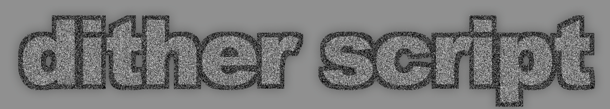
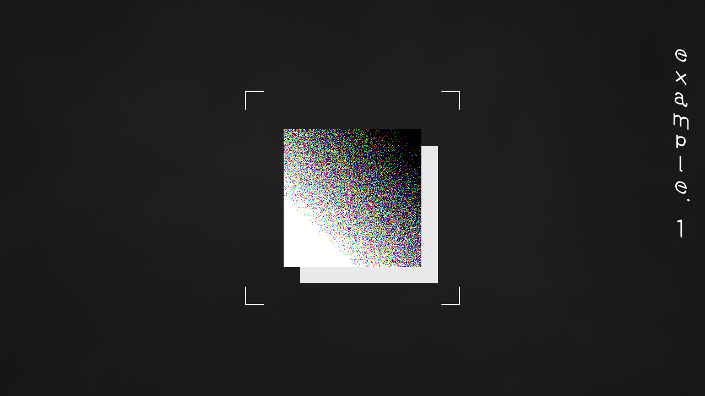
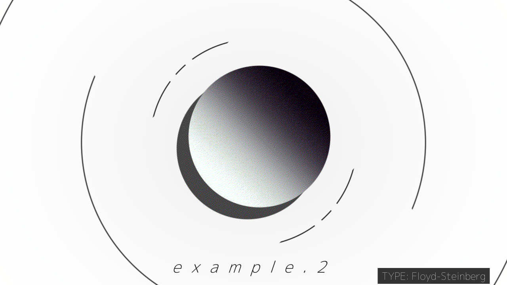
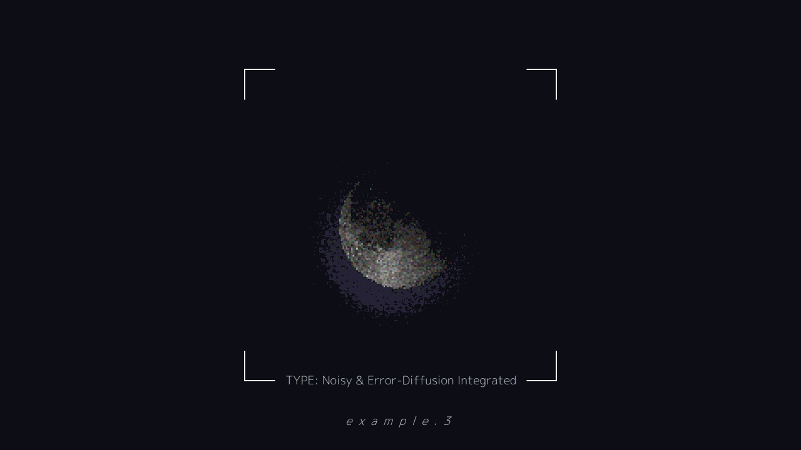
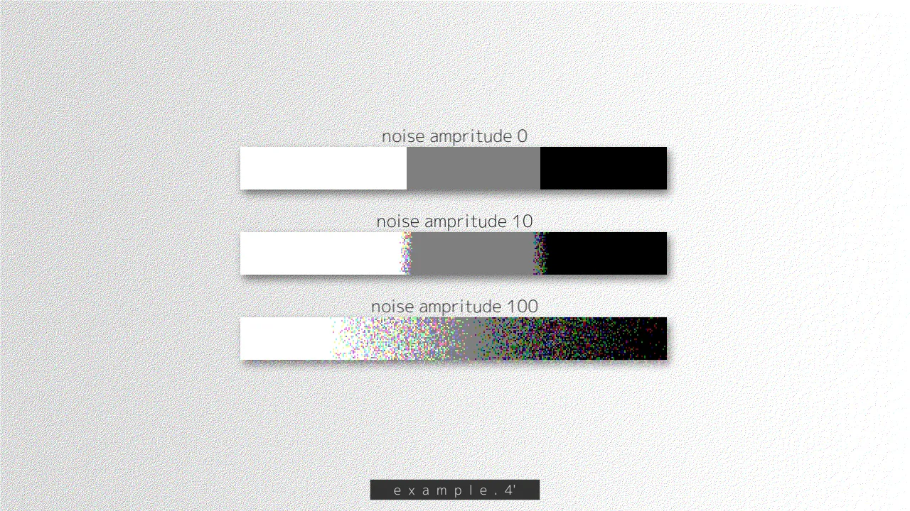
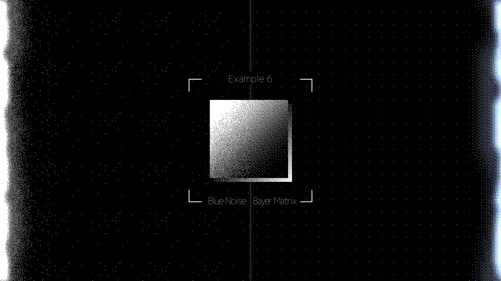
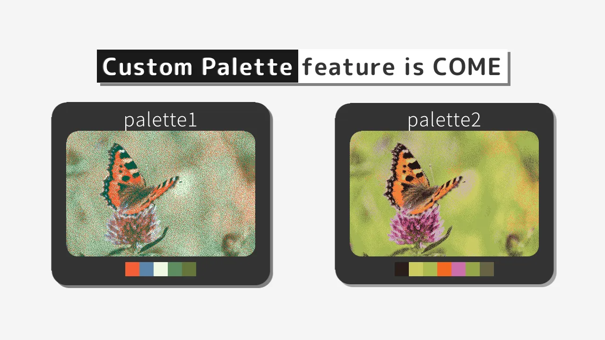
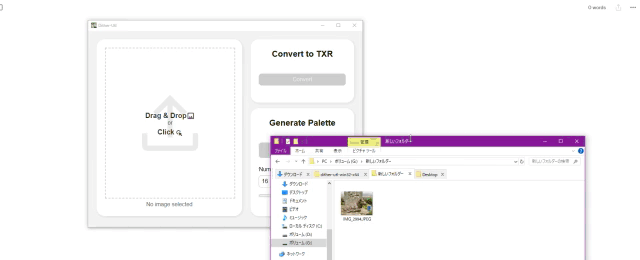

---

# Dither script

画像にディザ処理をかけるアニメーション効果を追加するスクリプトです。

画像にザラつきを加えたり、ドット絵のような見た目にすることができます。

また、自作テクスチャの作成やカラーパレットの自動生成をするためのアプリ `DitherUtl` も同梱しています。

## サンプル

## 動作条件

開発者が動作確認を行った環境は以下の通りです。

- AviUtl version 1.10
- 拡張編集 version 0.92
- patch.aul r43_ss_71
- rikky module 1.4b

## インストール/アンインストール

**まず始めに [rikky_module](https://hazumurhythm.com/wev/amazon/?script=rikkymodulea2Z) をお使いの AviUtl にインストールしてください。**

その後、Release から最新の zip をダウンロードして解凍してください。

解凍したフォルダ内にある `@ditherScript.anm`, `DITHERINGS.dll`, `ditherAssets`フォルダ の3つを AviUtl の `script` フォルダまたはそのサブフォルダにコピーしてください。

また導入の際に `ditherAssets` フォルダのパスを `@ditherScript.anm` 内の `--dialog:テクスチャフォルダ, fold="ここに記入"` しておくと便利です (`@ErrorNoisyDither` と `@PaletteDither` の下2か所に記入場所があります)。
記入の際、バックスラッシュ (または円マーク) `\` は**全て `\\` に置き換えてください。**

アンインストールするには導入したファイルおよびフォルダを削除してください。

`DitherUtl` は AviUtl とは独立して動作するため、`DitherUtl` フォルダを好きな場所に配置して使用してください

## 使い方

`@ditherScript.anm` には

- `ErrorNoisyDither`
- `CustomTextureDither`
- `PaletteDither`
- `CustomTexturePaletteDither`

の 4つのエフェクトが含まれています。

いずれも画像オブジェクトや動画オブジェクトなどに適用して使用することができます。

以下それぞれのエフェクトの設定項目について説明します。

### ErrorNoisyDither

基本のディザエフェクトです。RGB空間から等間隔に選んだ色を使ってディザ処理を行います。

#### トラックバー
- `ノイズ強度` : ノイズによるザラつきの強さを調整します。値が大きいほどノイズが強くなります
- `色数` : 使用する色の数を調整します。値が大きいほど色数が増え、ザラつきが緩やかになります
- `ノイズ`: ノイズの種類を選択します。以下の 7 種類から選べます
  - `0` : なし
  - `1` : ホワイトノイズ (RGB各チャンネル同じ値)
  - `2` : ホワイトノイズ (RGB各チャンネル異なる値)
  - `3` : ブルーノイズ (RGB各チャンネル同じ値)。ホワイトノイズよりも均一に分布します
  - `4` : ブルーノイズ (RGB各チャンネル異なる値)
  - `5` : Bayer 行列 (RGB各チャンネル同じ値)。ドット絵のようなパターンを作ります
  - `6` : Bayer 行列 (RGB各チャンネル異なる値)
- `伝搬方法` : 誤差伝播アルゴリズムの種類を選択します。以下の 10 種類から選べます。数字が大きいほど伝搬が滑らかになります
  - `0` : なし
  - `1` : Sierra Lite
  - `2` : False Floyd-Steinberg
  - `3` : Atkinson
  - `4` : Floyd-Steinberg
  - `5` : Two-row Sierra
  - `6` : Burkes
  - `7` : Sierra
  - `8` : Stucki
  - `9` : Jarvis, Judice, and Ninke

#### パラメータ設定

- `テクスチャフォルダ` : ブルーノイズおよび Bayer Matrix によるディザを行うために使用するテクスチャフォルダのパスを指定します。`ditherAssets` フォルダの絶対パスを指定してください
  - 例: `C:\\AviUtl\\script\\32842327\\ditherAssets`
- `テクスチャサイズ` : テクスチャのサイズを指定します。
  - **ブルーノイズ (ノイズが `3` または `4`) の場合** : `16`, `32`, `64`, `128`, `256`, `512` のいずれかを指定してください
  - **Bayer Matrix (ノイズが `5` または `6`) の場合** : `2`, `4`, `8`, `16` のいずれかを指定してください
- `ドットサイズ` : ピクセルの大きさを変更できます。値が大きいほどドットが大きくなります
- `伝搬方向` : 誤差伝播の方向を指定します。`0` から `3` の整数値で指定してください
- `時間変化` : ノイズを時間で変化させるかどうかを指定します

### CustomTextureDither

使用するノイズを指定できるエフェクトです。

ノイズの場所やサイズを変更することもできます。

以下設定項目です (インラインブロックでない場合は `@ErrorNoisyDither` と同じです)。

#### トラックバー
- ノイズ強度 : ノイズによるザラつきの強さを調整します。値が大きいほどノイズが強くなります
- `X座標` : ノイズの X 座標を指定します
- `Y座標` : ノイズの Y 座標を指定します
- `拡大率` : ノイズの拡大率を指定します

#### パラメータ設定

- `テクスチャ` : 使用するノイズのテクスチャファイルのパスを指定します。`.txr` 形式のファイルを指定してください
  - 例: `C:\\AviUtl\\script\\32842327\\ditherAssets\\bluenoise\\64x64-1.txr`
- ドットサイズ : ピクセルの大きさを変更できます。値が大きいほどドットが大きくなります
- 伝搬方法 : 誤差伝播アルゴリズムの種類を選択します。以下の 10 種類から選べます。数字が大きいほど伝搬が滑らかになります
  - `0` : なし
  - `1` : Sierra Lite
  - `2` : False Floyd-Steinberg
  - `3` : Atkinson
  - `4` : Floyd-Steinberg
  - `5` : Two-row Sierra
  - `6` : Burkes
  - `7` : Sierra
  - `8` : Stucki
  - `9` : Jarvis, Judice, and Ninke
- 伝搬方向 : 誤差伝播の方向を指定します。`0` から `3` の整数値で指定してください
- 色数 : 使用する色の数を調整します。値が大きいほど色数が増え、ザラつきが緩やかになります
- `中心X座標` : ノイズの中心座標を指定します (X座標)
- `中心Y座標` : ノイズの中心座標を指定します (Y座標)
  - 中心座標を変更すると拡大の仕方などが変わります
- `ループさせる` : ノイズをループするかどうか指定します
- `中心を表示` : ノイズの中心を表示するかどうか指定します。ループなどをさせていて中心が分かりにくいときに便利です

### PaletteDither

使用する色を指定できる `ErrorNoisyDither` です。

使用する色は `{0x000000, 0xffffff}` のようにして指定してください

以下設定項目です (インラインブロックでない場合は `ErrorNoisyDither` と同じです)。

#### トラックバー
- ノイズ強度 : ノイズによるザラつきの強さを調整します。値が大きいほどノイズが強くなります
- `色候補数` : 使用する色候補の数を調整します。値が大きいほどクオリティが上がりますが、処理が重くなります
- ノイズ: ノイズの種類を選択します。以下の 7 種類から選べます
  - 0 : なし
  - 1 : ホワイトノイズ (RGB各チャンネル同じ値)
  - 2 : ホワイトノイズ (RGB各チャンネル異なる値)
  - 3 : ブルーノイズ (RGB各チャンネル同じ値)。ホワイトノイズよりも均一に分布します
  - 4 : ブルーノイズ (RGB各チャンネル異なる値)
  - 5 : Bayer 行列 (RGB各チャンネル同じ値)。ドット絵のようなパターンを作ります
  - 6 : Bayer 行列 (RGB各チャンネル異なる値)
- 伝搬方法 : 誤差伝播アルゴリズムの種類を選択します。以下の 10 種類から選べます。数字が大きいほど伝搬が滑らかになります
  - 0 : なし
  - 1 : Sierra Lite
  - 2 : False Floyd-Steinberg
  - 3 : Atkinson
  - 4 : Floyd-Steinberg
  - 5 : Two-row Sierra
  - 6 : Burkes
  - 7 : Sierra
  - 8 : Stucki
  - 9 : Jarvis, Judice, and Ninke

#### パラメータ設定

- テクスチャフォルダ : ブルーノイズおよび Bayer Matrix によるディザを行うために使用するテクスチャフォルダのパスを指定します。`ditherAssets` フォルダの絶対パスを指定してください
  - 例: `C:\\AviUtl\\script\\32842327\\ditherAssets`
- `テクスチャサイズ` : テクスチャのサイズを指定します。
  - ブルーノイズ (ノイズが `3` または `4`) の場合 : `16`, `32`, `64`, `128`, `256`, `512` のいずれかを指定してください
  - Bayer Matrix (ノイズが `5` または `6`) の場合 : `2`, `4`, `8`, `16` のいずれかを指定してください
- `使う色` : 使用する色を指定します。`{0x000000, 0xffffff}` のようにして指定してください。色は `0xrrggbb` の形式で指定してください
- ドットサイズ : ピクセルの大きさを変更できます。値が大きいほどドットが大きくなります
- 伝搬方向 : 誤差伝播の方向を指定します。`0` から `3` の整数値で指定してください
- 時間変化 : ノイズを時間で変化させるかどうかを指定します

### CustomTexturePaletteDither

使用する色を指定できる `CustomTextureDither` です。

使用する色は `{0x000000, 0xffffff}` のようにして指定してください

以下設定項目です (インラインブロックでない場合は `CustomTextureDither`, `PaletteDither` と同じです)。

#### トラックバー
- ノイズ強度 : ノイズによるザラつきの強さを調整します。値が大きいほどノイズが強くなります
- X座標 : ノイズの X 座標を指定します
- Y座標 : ノイズの Y 座標を指定します
- 拡大率 : ノイズの拡大率を指定します

#### パラメータ設定

- テクスチャ : 使用するノイズのテクスチャファイルのパスを指定します。`.txr` 形式のファイルを指定してください
  - 例: `C:\\AviUtl\\script\\32842327\\ditherAssets\\bluenoise\\64x64-1.txr`
- ドットサイズ : ピクセルの大きさを変更できます。値が大きいほどドットが大きくなります
- 伝搬方法 : 誤差伝播アルゴリズムの種類を選択します。以下の 10 種類から選べます。数字が大きいほど伝搬が滑らかになります
  - `0` : なし
  - `1` : Sierra Lite
  - `2` : False Floyd-Steinberg
  - `3` : Atkinson
  - `4` : Floyd-Steinberg
  - `5` : Two-row Sierra
  - `6` : Burkes
  - `7` : Sierra
  - `8` : Stucki
  - `9` : Jarvis, Judice, and Ninke
- 伝搬方向 : 誤差伝播の方向を指定します。`0` から `3` の整数値で指定してください
- 使う色 : 使用する色を指定します。`{0x000000, 0xffffff}` のようにして指定してください。色は `0xrrggbb` の形式で指定してください
- 色候補数 : 使用する色候補の数を調整します。値が大きいほどクオリティが上がりますが、処理が重くなります
- `色を混ぜる` : 使用する色の RGB チャンネルを混ぜるかどうかを指定します
- 中心X座標 : ノイズの中心座標を指定します (X座標)
- 中心Y座標 : ノイズの中心座標を指定します (Y座標)
  - 中心座標を変更すると拡大の仕方などが変わります
- ループさせる : ノイズをループするかどうか指定します
- 中心を表示 : ノイズの中心を表示するかどうか指定します。ループなどをさせていて中心が分かりにくいときに便利です
- 時間変化 : ノイズを時間で変化させるかどうかを指定します

## DitherUtl

テクスチャの作成やカラーパレットの自動生成を行うアプリです。

`ditherutl` フォルダ内にある `ditherutl.exe` を実行することで起動します。

アプリの左半分に画像ファイルをドラッグ&ドロップすることで、画像ファイルを読み込むことができます。

### テクスチャ作成

ブルーノイズや Bayer Matrix は事前に生成した `.txr` ファイルを読み込んで使用しています。

`DitherUtl` を使用することで、好きな画像を元に `.txr` ファイルを生成することができます。

#### 作成方法

ファイルを読み込んだ後、右上の `Convert` ボタンを押すことで、画像ファイルがあるフォルダに `.txr` ファイルが生成されます。

### カラーパレット作成

`PaletteDither` や `CustomTexturePaletteDither` の `使う色` にて指定するカラーパレットを自動生成することができます。

#### 作成方法

ファイルを読み込んだ後、右下の `Generate` ボタンを押してください。その後、右にある緑色のボタンを押すことで、カラーパレットがクリップボードにコピーされます。

コピーされたカラーパレットはそのまま `使う色` に貼り付けることができます。

`Generate` ボタンの下にある欄で、カラーパレットの色数を指定することができます。

## 謝辞

本スクリプトを作成するにあたり、以下の文献を参考にさせていただきました。この場を借りてお礼申し上げます。

- 誤差伝播アルゴリズムの定義行列に関しては [Tanner Helland, Image Dithering: Eleven Algorithms and Source Code | tannerhelland.com](https://tannerhelland.com/2012/12/28/dithering-eleven-algorithms-source-code.html) を参考にさせていただきました
- カラーパレットの自動生成については [Pérez-Delgado, ML., Celebi, M.E. A comparative study of color quantization methods using various image quality assessment indices](https://doi.org/10.1007/s00530-023-01206-7) を参考にさせていただきました
- パレットディザリングの実装については [Joel Yliluoma, Arbitrary-palette positional dithering algorithm](https://bisqwit.iki.fi/story/howto/dither/jy/) を参考にさせていただきました。
